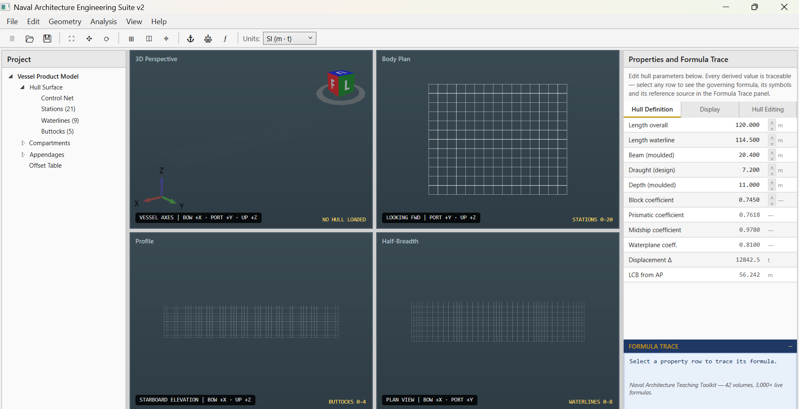

<p align="center">
  
</p>

<h1 align="center">Naval Architecture Engineering Suite v2</h1>

<p align="center">
  <strong>Industrial-grade naval architecture CAD/CAE — free for students, subscription for professionals.</strong><br>
  Built on OpenCASCADE Technology (OCCT) — the same geometry kernel powering FreeCAD.
</p>

<p align="center">
  <a href="https://github.com/alperalacam/NavalArchitectureSuite/releases/tag/v1.0">
    
  </a>
  
  
  
  <a href="https://www.linkedin.com/in/alper-alacam-b70b9566">
    
  </a>
</p>

---

<p align="center">
  
</p>

<p align="center">
  <em>Suite v2 under development — body plan, profile, half-breadth and 3D perspective,<br>
  with every derived value traceable to its governing formula and source volume.</em>
</p>

---

## What is Suite v2?

Suite v2 transforms the calculation-driven v1.0 into a **full parametric CAD/CAE modelling environment** — with a real NURBS geometry kernel, exact hydrostatics, vessel-intelligent formula selection, FEM solvers, and a transparent formula trace system that no competing tool offers.

**The goal:** be better than NAPA and Maxsurf — not by copying them, but by doing what they cannot: free for students, intelligent by vessel type, and transparent in every calculation.

---

## Why Suite v2 is Different

| Feature | NAPA / Maxsurf | Suite v2 |
|---|---|---|
| **Price** | €50,000–€200,000/seat/year | Free (Student) · from $49/month (Pro) |
| **Geometry kernel** | Proprietary | OpenCASCADE OCCT (proven, open) |
| **Formula transparency** | Black box | Full trace — click any result, see every equation and source |
| **Vessel intelligence** | Same interface for all | 16 categories — only valid formulas shown per vessel type |
| **Teaching mode** | None | Every formula explained and cited to primary source |
| **Coverage** | General ships | 195 vessel types — log raft to FLNG |
| **Class societies** | DNV/LR built-in | RINA, LR, ABS, Turkish Lloyd — selectable |
| **FEM modules** | External (ANSYS) | Built-in structural, thermal, acoustic FEM |
| **Offline capability** | Requires connection | 30-day offline grace — works on ships |
| **Open source** | No | v1.0 fully open-source on GitHub |

---

## The Formula Trace Panel — Our Killer Feature

Every calculated value in Suite v2 is fully auditable. Click any result — GZ, displacement, power, or plate thickness — and see the complete derivation:

```
GM  =  KM − KG  =  12.36 − 10.20  =  2.16 m  ✅ IMO IS Code: GM ≥ 0.15 m

  KM  =  KB + BM  =  5.38 + 6.98  =  12.36 m
    KB  =  T × (5/6 − Cb/(3×Cwp))  =  10.2 × (0.833 − 0.306)  =  5.38 m
      Source: Morrish approximation — Biran (2003) p.112
    BM  =  IT / ∇  =  267,449 / 38,316  =  6.98 m
      IT  =  (1/12) × LWL × B³ × Cwp  =  267,449 m⁴
      ∇   =  LWL × B × T × Cb  =  38,316 m³
        Source: IMO IS Code (2008) Clause 2.2.1
```

No other naval architecture software provides this level of transparency. NAPA cannot add it — their codebase is 35 years old. **This single feature makes Suite v2 the tool of choice for education, regulatory submissions, and auditing.**

---

## Vessel Intelligence Engine

Suite v2 knows which formulas are valid for each vessel type. Select your vessel category — the software shows only the correct methods, warns when parameters are outside valid ranges, and hides formulas that do not apply.

**16 Vessel Categories · 195 Vessel Types**

| # | Category | Examples | Key Difference |
|---|---|---|---|
| A | Displacement Commercial | Bulk carrier, VLCC, container | Holtrop-Mennen, L/B=5–8, Cb=0.65–0.87 |
| B | Displacement Passenger | Cruise ship, ferry, Ro-Pax | High freeboard wind heeling, L/B=6–9 |
| C | Naval / Military | Destroyer, frigate, aircraft carrier | Slender form L/B=8–12, NATO STANAG stability |
| D | Workboats & Special Service | Tug, icebreaker, dredger, SAR | L/B=3–6, bollard pull, towing analysis |
| E | Fishing Vessels | Trawler, seiner, longliner | Capsize risk, low L/T, IMO fishing vessel code |
| F | Offshore Support (OSV) | PSV, AHTS, DSV, construction | DP2/DP3, IMO MSC/Circ.645, thruster sizing |
| G | High-Speed / Planing | RIB, patrol boat, fast ferry | Savitsky method, Fv > 1.5, ISO 12217 HSC |
| H | Multihull | Catamaran, SWATH, trimaran | Hull L/B=8–16, cross-deck structure, Insel-Molland |
| I | Sailing Vessels | Cruising yacht, IMOCA, tall ship | Heel under sail, righting moment, STIX |
| J | Superyachts | Motor superyacht, explorer, megayacht | MCA LY3, high freeboard, pod drives |
| K | Submarines | SSK, SSN, AUV, ROV | L/D ratio, pressure hull Von Mises, reserve buoyancy |
| L | Barges & Non-Propelled | Deck barge, hopper, floating drydock | Cb=0.85–0.98, tow resistance, barge stability |
| M | Floating Offshore | FPSO, semi-sub, TLP, spar | API/offshore stability codes, mooring catenary |
| N | Fixed Offshore | Jacket, jack-up, GBS, monopile | API RP 2A, no hull ratios — structural governs |
| P | Inland & River | Canal boat, river cargo, push convoy | Depth Froude Fh, lock dimensions L/B=7–15 |
| Q | Primitive / Traditional | Raft, dugout canoe, lifeboat | Archimedes only, no empirical methods |

---

## Core Modules — v2.0

### 🔷 Module A — Advanced Hull Surface & Appendage Modelling
- Real NURBS surfaces via OpenCASCADE BREP
- Multi-surface trimming: bulbous bow blending, skeg joinery, thruster tunnels
- Zebra stripe and porcupine curvature analysis — visual fairness verification
- Boolean operations with cyan/amber highlight before commit
- Feature operations: chamfers, fillets, sheer curves, transom sterns

### 🔷 Module B — CAD Import / Export Pipeline
- STEP, IGES, BREP, STL, OBJ — import and export
- Rhino, SolidWorks, AutoCAD compatibility
- Auto-repair for non-watertight surface meshes
- Watertightness verification before hydrostatic analysis
- Lines Plan export: PDF (vector), DXF, STEP
- Linework hierarchy: ISO 128 standard (0.50/0.35/0.18mm weights)

### 🔷 Module C — Exact Hydrostatics from OCCT Surface
- Non-linear floating equilibrium — exact position under any heel/trim/wave
- Real surface integration (not coefficient-based approximation)
- Real-time LCB, VCB, TCB update when control point moved
- Hydrostatic table generation across full draft range
- KN cross curves, GZ curve, righting moment

### 🔷 Module D — Stability (Deep)
- IMO IS Code 2008 — all 7 criteria
- SOLAS II-1 probabilistic damage stability (A/R index)
- Free surface correction per compartment
- Loading conditions: deadweight, ballast, full load, departure/arrival
- Tank sounding tables
- Wind heeling criterion — API 2MET for offshore

### 🔷 Module E — Resistance & Propulsion
- Holtrop-Mennen 1984 — displacement vessels (Vols 3, 12)
- Savitsky 1964 — planing hulls (Vol 39)
- Insel-Molland — catamaran demihull resistance
- Submerged body drag — submarines (Vol 6)
- Shallow water correction — Fh = V/√(gd) for inland vessels
- Wageningen B-series propeller optimisation
- Waterjet sizing and JVR calculation (Vol 39)
- Azimuth thruster and DP thrust analysis (Vol 37)

### 🔷 Module F — Structural Analysis & FEM
- Hull girder section modulus (IACS Unified Rules)
- Still water and wave bending moment
- Plate thickness (IACS, ISO 12215)
- **2D Beam FEM:** frame analysis, stiffness matrix, displacement solution
- **Plate buckling FEM:** Euler, Johnson-Ostenfeld, IACS-based
- **Pressure hull analysis:** Von Mises, ring frame buckling (Vol 6)
- Fatigue check — weld toe stress concentration
- Slamming loads — ISO 12215-5 design pressure (Vol 39)

### 🔷 Module G — Thermal Analysis & FEM
- **2D Thermal FEM:** conduction, Dirichlet/Neumann boundary conditions
- Heat exchanger sizing — LMTD and NTU-ε methods (Vol 35)
- Engine room heat balance
- LNG cargo containment insulation design (Vol 28)
- HVAC cooling load and psychrometrics (Vol 35)
- Boiler thermal cycle — Rankine, Diesel, Brayton (Vol 35)

### 🔷 Module H — Seakeeping & Motions
- Natural roll period: T = 2πk/√(gGM)
- Strip theory RAO (Response Amplitude Operators)
- Spectral analysis — JONSWAP, Pierson-Moskowitz
- Nordforsk accelerations — crew comfort and operability (Vol 13)
- Slamming probability and added resistance in waves
- Operability polar diagram

### 🔷 Module I — Machinery & Systems
- Main engine selection — full database (MAN B&W, WinGD, Wärtsilä, Bergen, MTU, Caterpillar)
- Auxiliary generator sizing
- Propulsion power chain: EHP → SHP → BHP
- EEDI / EEXI / CII calculation (MARPOL Annex VI)
- Piping systems — pump selection, NPSH, affinity laws (Vol 36)
- Compressed air systems — starting air, control air (Vol 36)
- Marine electrical load analysis — IEC 60092 (Vol 37)
- PMS blackout prevention thresholds (Vol 37)

### 🔷 Module J — Special Vessel Modules
- **Submarine:** reserve buoyancy, surfacing stability, diving trim (Vol 6)
- **Offshore / DP:** DP1/2/3 power redundancy, catenary mooring, API loads (Vols 14, 37)
- **Ice class:** Lindqvist resistance, IACS PC loads, Polar Code (Vol 34)
- **LNG:** boil-off gas, FGSS sizing, IGC Code compliance (Vol 28)
- **Underwater noise:** radiated noise prediction, cavitation inception (Vol 33)
- **Planing hulls:** Savitsky full calculation, ISO 12215 structural (Vol 39)
- **Composites:** laminate theory, Tsai-Wu failure, sandwich panels (Vol 40)
- **Electric/hybrid propulsion:** battery sizing, VFD, hybrid energy management (Vol 41)

### 🔷 Module K — Class Rule Validation Engine
- **Selectable class society:** RINA · Lloyd's Register · ABS · Turkish Lloyd (Türk Loydu)
- IMO IS Code 2008 stability criteria
- SOLAS II-1 damage stability
- ICLL 1966 freeboard assignment
- ITC 1969 tonnage
- MARPOL Annex I, IV, VI
- Export: classification-ready hydrostatic tables and lines plans

---

## Licensing Model

Suite v2 uses **subscription desktop licensing with online activation** — proven by AutoCAD, ANSYS, and Rhino3D.

| Tier | Price | Seats | Offline | Features |
|---|---|---|---|---|
| **Student** | Free | 1 | 30 days | All modules · watermarked export |
| **Standard** | $49 / month | 1 | 30 days | Full export · no watermark |
| **Professional** | $149 / month | 3 | 30 days | Class rule reports · priority support |
| **Enterprise** | $499 / month | 10+ | 30 days | Custom branding · API access |
| **Institutional** | Negotiated | Unlimited | 30 days | RINA / Turkish Lloyd / university |

**How activation works:**
- Install the desktop app — works immediately in 30-day trial
- Enter 25-character license key to activate
- License checked every 7 days via HTTPS heartbeat
- 30-day offline grace — works on ships, remote shipyards, areas with poor internet
- AES-256 encrypted local license cache — secure against tampering
- v1.0 remains free and open-source on GitHub — always

---

## Scientific Foundation

Based on the **Naval Architecture Teaching Toolkit** — 42 volumes, 3,000+ live formulas, all free and open educational resources. Every formula in Suite v2 is cited to its primary source.

### Group 1 — Naval Architecture Fundamentals
| Volume | Title |
|---|---|
| Vol 1 | Fundamental Calculations of Naval Architecture |
| Vol 4 | Structural Design & Scantlings |
| Vol 7 | Fluid Mechanics for Naval Architects and Marine Engineers |
| Vol 9 | Introduction to Finite Element Methods for Naval Architects |
| Vol 11 | Classification Societies and Marine Regulations |
| Vol 25 | Tonnage and Freeboard |

### Group 2 — Hydrodynamics, Resistance & Propulsion
| Volume | Title |
|---|---|
| Vol 2 | Ocean Hydrodynamics & Ship Motions |
| Vol 3 | Propeller, Machinery & Marine Materials |
| Vol 12 | Advanced Resistance and Powering — Holtrop-Mennen 1984 |
| Vol 17 | Bow Design |
| Vol 39 | Small Craft & Planing Hull Design |
| Vol 41 | Electric & Hybrid Propulsion Systems |

### Group 3 — Stability, Damage Stability & Manoeuvring
| Volume | Title |
|---|---|
| Vol 5 | Ship Manoeuvring & Control |
| Vol 8 | Damage Stability |
| Vol 13 | Seakeeping and Operability |
| Vol 26 | Damage Stability and Subdivision |
| Vol 27 | Ship Manoeuvring and Rudder Design |
| Vol 29 | Stability of Special Vessels |
| Vol 30 | Intact and Damage Stability in Depth |
| Vol 31 | Ship Manoeuvring and Hydrodynamics |

### Group 4 — Structures, Production & Materials
| Volume | Title |
|---|---|
| Vol 4 | Structural Design & Scantlings |
| Vol 9 | Introduction to Finite Element Methods for Naval Architects |
| Vol 15 | Marine Corrosion and Corrosion Protection |
| Vol 21 | Welding Engineering |
| Vol 22 | Shipbuilding Welding Practice |
| Vol 32 | Ship Production and Outfitting |
| Vol 40 | Composite Materials & FRP Structures |

### Group 5 — Marine Systems, Machinery & Thermodynamics
| Volume | Title |
|---|---|
| Vol 18 | Gas and Steam Turbines |
| Vol 19 | Marine Diesel Engines |
| Vol 20 | Marine Auxiliary Systems |
| Vol 28 | LNG Cargo Systems |
| Vol 35 | Thermodynamics & Heat Transfer for Marine Engineers |
| Vol 36 | Marine Mechanical Engineering |
| Vol 37 | Marine Electrical Systems & Power Management |
| Vol 38 | Ship Automation & Control Systems |

### Group 6 — Special Vessels & Advanced Topics
| Volume | Title |
|---|---|
| Vol 6 | Submarine Engineering |
| Vol 10 | Hovercraft Engineering |
| Vol 14 | Offshore Structures and Drilling Platforms |
| Vol 16 | Marine Vibration and Noise |
| Vol 23 | Yacht Design |
| Vol 24 | Advanced Yacht Design |
| Vol 33 | Underwater Noise and Signatures |
| Vol 34 | Ice Class and Polar Operations |
| Vol 42 | Marine Safety, Risk & Reliability Engineering |

---

## Technology Stack

| Component | Technology | Purpose |
|---|---|---|
| Language | C# / .NET 8 | Core application |
| UI Framework | WPF | Desktop GUI |
| 3D Viewport | HelixToolkit.Wpf + OpenCASCADE | Hull visualisation and CAD |
| Geometry Kernel | OpenCASCADE Technology (OCCT) via Macad.Kernel | NURBS surfaces, BREP solids, Boolean ops |
| Interoperability | STEP · IGES · BREP · STL · OBJ | CAD file exchange (Rhino, SolidWorks, AutoCAD) |
| Charts | OxyPlot | GZ curves, resistance curves, power charts |
| FEM Solver | Custom C# (stiffness matrix assembly) | Structural and thermal FEM |
| PDF Export | SimplePdfDocument (custom, dependency-free) | Vector PDF, A0–A4, ISO 128 linework |
| License Server | Azure App Service + AES-256 | Online activation, seat management |
| Database | SQLite | Project files, engine database |
| Data Exchange | Dynamic DLL-based API (LGPL compliant) | OCCT legal compliance |

---

## Roadmap

| Phase | Scope | Status |
|---|---|---|
| 1 | OCCT proof of concept — NURBS hull in HelixToolkit | Planned |
| 2 | Hull surface engine — slicing, offset table, Lines Plan | Planned |
| 3 | Compartment modelling — solids, colours, volumes | Planned |
| 4 | Exact hydrostatics and stability from OCCT surface | Planned |
| 5 | Resistance — Holtrop, Savitsky, Insel-Molland | Planned |
| 6 | Structural FEM — beam elements, plate buckling | Planned |
| 7 | Thermal FEM — 2D conduction, heat exchangers | Planned |
| 8 | Vessel Intelligence Engine — 16 categories, 195 types | Planned |
| 9 | Formula Trace Panel — full audit transparency | Planned |
| 10 | Class Rule Engine — RINA, LR, ABS, Turkish Lloyd | Planned |
| 11 | Engine & Equipment Database — 200+ entries | Planned |
| 12 | License Manager — online activation, tier system | Planned |
| 13 | PDF / Export — vector PDF, DXF, STEP, Excel summary | Planned |
| 14 | v2.0 Release | Planned |

---

## Current Stable Release

The current working version is **v1.0** — fully functional, 14 modules, 3,358 live formulas, free installer.

**[⬇ Download Naval Architecture Engineering Suite v1.0](https://github.com/alperalacam/NavalArchitectureSuite/releases/tag/v1.0)**

---

## Author

**Alper Alaçam** — Naval Architect & Marine Engineer, Türkiye

[](https://www.linkedin.com/in/alper-alacam-b70b9566)
[](https://github.com/alperalacam/NavalArchitectureSuite/releases/tag/v1.0)

---

*Free for students. Subscription for professionals. Dedicated to engineers who believe knowledge should be accessible to everyone.*

*Dedicated to my wife and daughters.*

© 2026 Alper Alaçam — Türkiye
